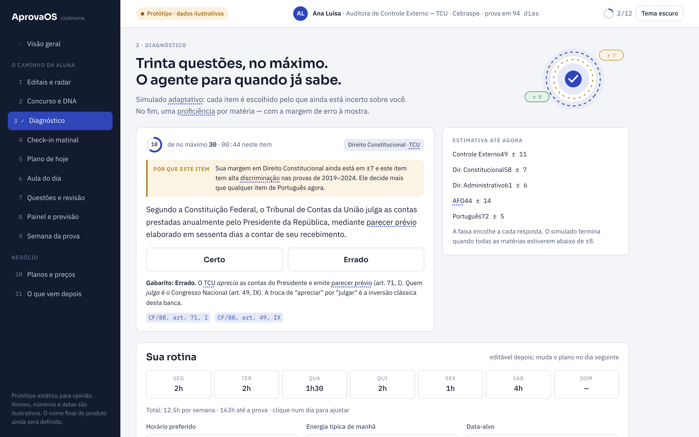
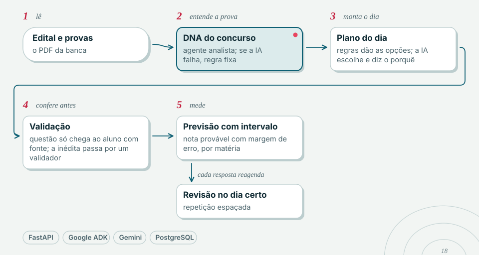

<picture>
  <source media="(prefers-color-scheme: dark)" srcset="docs/marca/cabecalho-escuro.svg">
  
</picture>

# AprovaOS

> `AprovaOS` é codinome de desenvolvimento; o nome comercial ainda não foi definido.



<sub>Tela do protótipo clicável em docs/evidencias/mockups, com persona e números ilustrativos. O plano do dia está em [docs/prints/aprovaos-plano.png](docs/prints/aprovaos-plano.png).</sub>

## Problema

Quem estuda para concurso perde a maior parte da energia decidindo o que estudar e,
principalmente, **esquecendo o que já estudou**. As ferramentas do mercado operam no
modo "você pergunta, a IA responde" — quem carrega o plano, cobra a revisão e mede o
progresso continua sendo o candidato.

## O que faz

Um agente que assume a responsabilidade pelo estudo: lê o edital, monta uma trilha,
entrega o plano do dia, gera questões inéditas no estilo da banca a partir de fontes
verificadas e reagenda a revisão pelo esquecimento de cada tópico — explicando cada
decisão. Vende resultado acompanhado, não ferramenta avulsa.

Principais capacidades do backend hoje:

- Diagnóstico e calibração do nível do candidato.
- Trilha e plano do dia a partir do edital.
- Geração e calibração de questões no padrão da banca (CEBRASPE, FGV).
- Revisão espaçada (FSRS) — "o fio da memória".
- Contas, assinatura, LGPD e billing.

## Arquitetura

<picture>
  <source media="(prefers-color-scheme: dark)" srcset="docs/marca/diagrama-escuro.svg">
  
</picture>


Backend em FastAPI com domínio isolado da infraestrutura (domínio puro, repositórios
sobre SQLAlchemy 2.0, rotas finas). O conhecimento é alimentado por um motor que ingere
fontes oficiais e públicas, sem depender de professor para nascer. O front é
server-rendered (Jinja2 + HTML/CSS) consumindo a API.

```
backend/aprovaos/
  dominio/       regras de negócio puras (sem I/O)
  dados/         repositórios sobre SQLAlchemy async
  api/           rotas FastAPI
web/             templates Jinja2 + estáticos
docs/            visão, arquitetura, modelo de dados, decisões (ADRs)
knowledge/       fontes e fixtures do motor de conhecimento
```

## Stack

Python 3.13 · FastAPI · SQLAlchemy 2.0 · Pydantic v2 · Alembic · PostgreSQL (psycopg) ·
Argon2 · Jinja2 · FSRS (revisão espaçada) · Google ADK. Testes com pytest; lint e tipos
com ruff e mypy.

## Como rodar

```bash
cd backend
uv sync
cp ../.env.example ../.env     # preencher as variáveis
uv run alembic upgrade head
uv run uvicorn aprovaos.api.app:app --reload
```

Sobe Postgres via `compose.yaml` se preferir container.

## Testes

```bash
cd backend
uv run pytest
```

Suíte atual: **1622 testes passando** (7 skipped). O domínio é testado sem I/O; as rotas
e repositórios têm testes de integração.

## Documentação

A pasta `docs/` guarda a visão do produto, arquitetura, modelo de dados, decisões (ADRs)
e as fatias de implementação. `docs/prints/` reserva espaço para capturas de tela.

## Status

Em desenvolvimento ativo (MVP do lado "quem estuda"). Backend com cobertura ampla de
testes; front em evolução.
